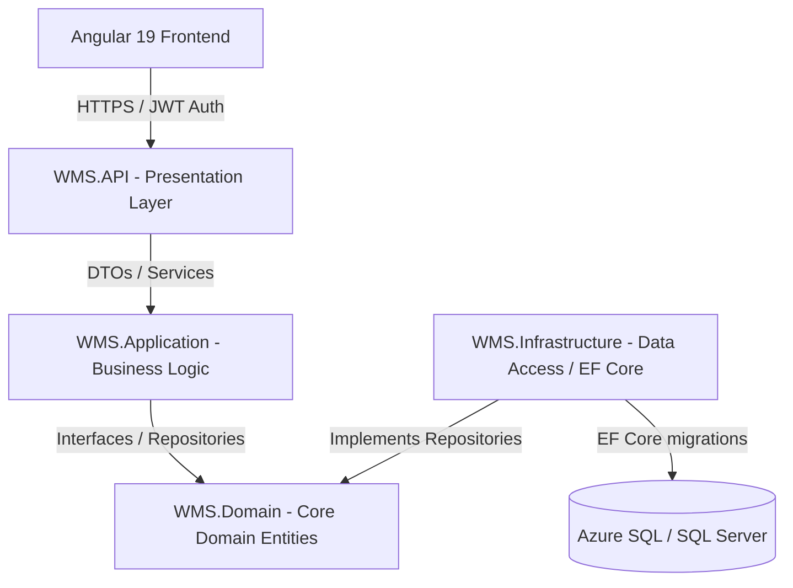
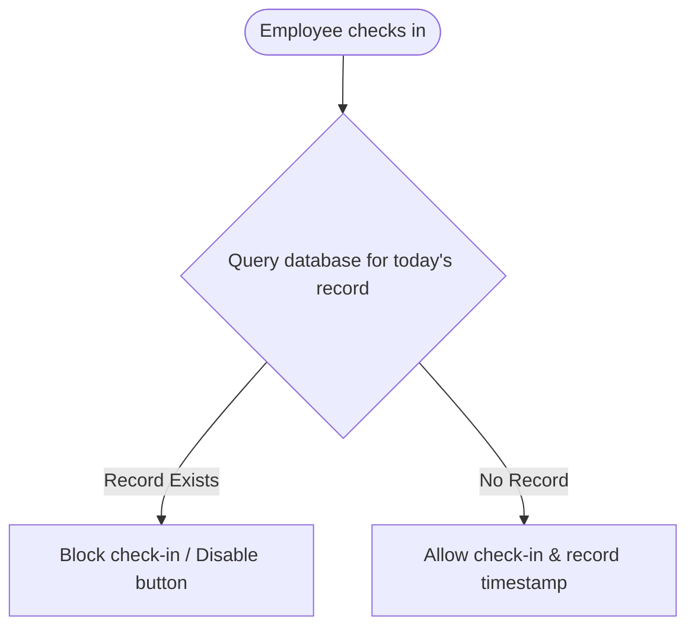

# Workforce Management System (WMS)
*Capstone Project — Left Shift Program 2026*

A complete, enterprise-grade full-stack Workforce Management System built with a **.NET Core 8 Web API** backend, **Angular 19** frontend, and **Azure SQL / SQL Server** database. The project follows a modular, layered architecture with robust security, automated CI/CD pipelines, and comprehensive unit test coverage.

---

## 🏗️ Layered System Architecture

The application is structured into clearly separated layers to ensure scalability, ease of testing, and maintainability (clean separation of concerns):



### Layer Details:
1. **`WMS.API` (Presentation Layer)**: Exposes RESTful endpoints, handles JWT authentication, configures CORS, and manages global exception middleware/logging.
2. **`WMS.Application` (Business Logic Layer)**: Contains core services, DTOs, FluentValidation rules, AutoMapper profiles, and generates timesheet PDF reports.
3. **`WMS.Domain` (Core Domain Layer)**: Defines system entities (Employee, Attendance, Leave, etc.) and repository interfaces. Contains no external dependencies.
4. **`WMS.Infrastructure` (Data Access Layer)**: Implements repository interfaces using EF Core and handles database migrations.
5. **`WMS.Frontend` (Client UI)**: Responsive Angular dashboard styled with Angular Material and interactive charts using Chart.js.

---

## 🔑 Key Features & Business Logic (How to explain in the interview)

Here are the key modules implemented to meet the business requirements:

### 1. Attendance & Daily Check-In Guard
* **Requirement**: Employees can only check-in **once** per calendar day. Once checked-out, they cannot check-in again on the same day.
* **Flow**:

* **Implementation**:
  - The backend checks for existing records on the current date and throws a custom validation exception if one exists.
  - The frontend dynamically disables the "Check In" button once a check-out is recorded for the day.

### 2. Leave Management & Approval Workflow
* **Requirement**: Employees apply for leaves (Sick, Casual, Earned), and managers approve or reject them.
* **Flow**:
  - **Apply**: Employee submits leave requests.
  - **Approve/Reject**: Managers review pending leaves in a centralized dashboard.

### 3. Employee & Department Management
* CRUD operations for managing employee details (First Name, Last Name, Email, DOB, Role).
* Deactivated employees cannot check-in/out or be allocated to new projects.

### 4. Project Allocation & Approvals
* Projects are created with client details.
* Employees are assigned to projects by managers, and the assignment requires manager approval.

---

## 🛠️ Technology Stack & Decisions

| Component | Technology | Why this choice? |
| :--- | :--- | :--- |
| **Frontend** | Angular 19 + Material | Modern component-based architecture, reactive forms, and robust type safety with TypeScript. |
| **Backend** | .NET Core 8 Web API | High-performance, cross-platform framework with native Dependency Injection. |
| **Database** | SQL Server / EF Core | Industry-standard relational DB using Code-First approach for schema migrations. |
| **Reports** | QuestPDF | High-performance PDF generation engine for timesheet reporting. |
| **Unit Testing** | xUnit + Mocking | Robust testing of business logic rules before deployment. |
| **CI/CD** | Azure DevOps | Integrated pipelines for automated build, test execution, and cloud deployment. |

---

## 🚀 Environment Setup & Running Locally

### Prerequisites
* .NET SDK 8.0
* Node.js LTS
* SQL Server LocalDB or Azure SQL instance

### Running the Project
1. **Database Setup**:
   Ensure connection string in `appsettings.json` points to your LocalDB instance. Run migrations:
   ```bash
   dotnet ef database update --project WMS.Infrastructure --startup-project WMS.API
   ```
2. **Start Backend Web API**:
   ```bash
   cd WMS.API
   dotnet run
   # API Swagger UI will be available at http://localhost:5280/swagger
   ```
3. **Start Angular Frontend**:
   ```bash
   cd WMS.Frontend
   npm install
   npm start
   # Application will be live at http://localhost:4200
   ```

---

## 🧪 Testing & Code Quality
All business logic is validated using unit tests under the `WMS.Tests` project.
* **Command to run tests**:
  ```bash
  dotnet test
  ```
* **Scenarios Covered**:
  - Daily check-in restriction logic.
  - Leave duration validations.
  - Project assignment constraints.

---

## 🚢 DevOps & Deployment Flow

The code is managed via a Git branching strategy (`main`, `dev`, `feature/*`) and fully deployed to Azure:

* **CI/CD Tooling**: Azure DevOps Pipelines (`WMS.DevOps/azure-pipelines.yml`).
* **Azure Resources**:
  - **Database**: Azure SQL Database
  - **API Web Service**: Azure App Service
  - **Web Application**: Azure Static Web Apps (SWA)
